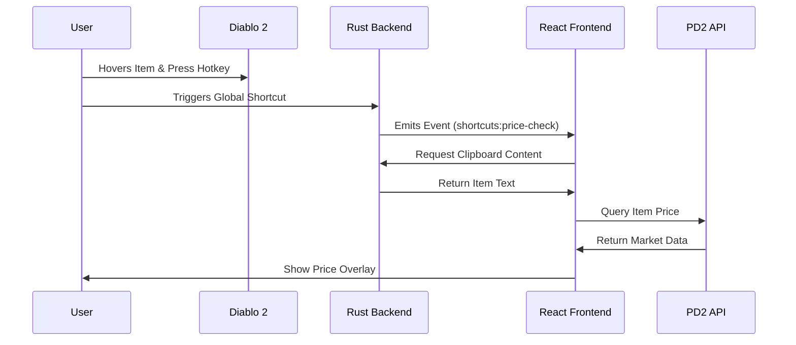
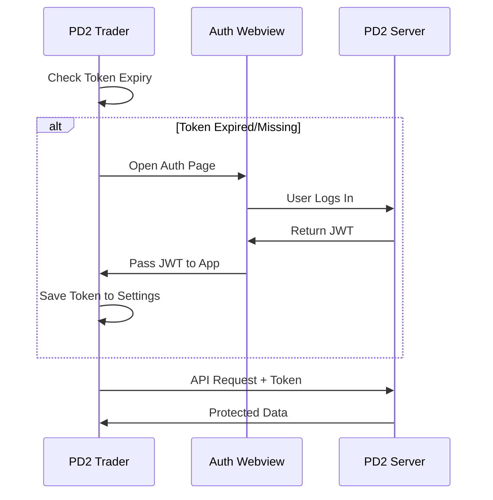

# 🏗️ PD2 Trader Application Architectures

## 1. ⚛️ Frontend Architecture (TypeScript)

The frontend is a **React** application built with **Vite** and styled using **Tailwind CSS**. It serves as the primary user interface for trading, price checking, and settings management.

### Key Components

- **Pages**: Located in `src/pages`. Each feature (Price Check, Trade Chat, Settings) has its own directory.
- **Hooks**: Custom hooks in `src/hooks` encapsulate logic for authentication (`usePD2Auth`), trading (`useTradeOffers`), and system interaction.
- **IPC Layer**: Wrappers in `src/lib/browser-events.ts` and `src/lib/browser-http.ts` abstract the communication with the Rust backend and external APIs.

### 👶 "Explain it like I'm 5"

Imagine the frontend is like the dashboard of a car. It shows you the speed (prices), lets you turn on the radio (chat), and tells the engine (backend) what to do when you press the pedals (buttons).

## 2. 🦀 Backend Architecture (Rust)

The backend is built with **Tauri** using **Rust**. It handles system-level tasks that a web browser cannot do, like reading game files, simulating keystrokes, and managing transparent overlay windows.

### Key Modules

- **Commands**: Defined in `src-tauri/src/modules/commands.rs`. These are functions the frontend can call directly (e.g., `get_diablo_rect`, `press_key`).
- **Chat Watcher**: `src-tauri/src/modules/chat_watcher.rs`. Monitors the Diablo 2 chat log file for new messages and emits events to the frontend.
- **Window Management**: `src-tauri/src/modules/window/`. Handles low-level window positioning and focus tracking to ensure overlays appear correctly over the game.
- **Keystroke Simulation**: Implemented in `src-tauri/src/modules/keyboard.rs` using the **Enigo** crate.
  - **How it works**: The frontend sends a string like "Ctrl+V". The backend parses this string, separating modifiers (Ctrl, Alt) from the main key (V). It then uses OS-level inputs to simulate pressing the modifiers down, clicking the main key, and releasing the modifiers. This is essential for features like "Quick List" or Item Search, where you can hover over an item and press the hotkey to quick list it and the application will first copy the item you are hovering over then issuing the list command.

### 👶 "Explain it like I'm 5"

The backend is the car's engine and wheels. It does the heavy lifting—reading the road (game files), moving the car (windows), and honking the horn (simulating keys) when the dashboard (frontend) tells it to. It uses a robotic finger (Enigo) to press buttons on your keyboard when you ask it to.

## 3. 🔄 Frontend <-> Backend Interaction

The two sides communicate using **Tauri's Inter-Process Communication (IPC)**.

### Common Interaction Flows

#### A. Price Checking an Item

1.  **User Action**: User presses `Ctrl+C` on an item in Diablo 2.
2.  **Backend Detect**: The clipboard change or hotkey is detected (managed by `tauri-plugin-clipboard` or global shortcuts).
3.  **Frontend Receive**: Logic in `src/hooks/useShortcuts.tsx` or clipboard listeners captures the item text.
4.  **Process**: The item text is parsed and a `new-search` event is emitted.
5.  **Display**: `src/pages/price-check/ItemPage.tsx` listens for the event, opens the overlay, and queries the PD2 API for prices.



#### B. Trade Chat Monitoring

1.  **Setup**: Frontend calls `start_chat_watcher` with the game directory.
2.  **Monitor**: Backend polls or watches the `chat.log` file for changes.
3.  **Notify**: When a line is written, Backend emits a `chat-event` to Frontend.
4.  **Display**: Frontend parses the line (e.g., "Offer: ...") and shows a notification.

### 👶 "Explain it like I'm 5"

It's like a walkie-talkie. The Frontend presses a button to say "Hey Backend, check the prices!" The Backend heads out, does the work, and radioes back "Here are the prices!" Sometimes the Backend speaks first, like "Hey Frontend, I just heard a new chat message!"

## 4. 🔒 Security & Authorization Flows

Authentication is handled securely via **JSON Web Tokens (JWT)**.

### Auth Flow

- **Token Storage**: The JWT is stored in the application settings (`src/hooks/useOptions.tsx`).
- **Login**:
  - If no token exists or it is expired, `usePD2Auth.tsx` triggers a login flow.
  - **Tauri**: Opens a secure webview to `projectdiablo2.com/auth`.
  - **Browser**: Redirects to the auth page.
- **Handover**: Once authenticated on the website, the site passes the token back to the application via a custom protocol or event, which is captured and saved.

### API Security

- All requests to `api.projectdiablo2.com` include the `Authorization: Bearer <token>` header.
- The backend does _not_ store passwords. It only holds the temporary access token.

> [!IMPORTANT]
> **Authenticated Actions**
> The following actions require a valid PD2 Token:
>
> - **Fetching Trade Offers**: Viewing incoming and outgoing offers.
> - **Managing Offers**: Accepting, rejecting, or revoking offers.
> - **Price Checking (Specific)**: Some detailed market data may require user context (though general price checks are often public).
> - **Social**: Retrieving user account details or friends.



### 👶 "Explain it like I'm 5"

The app needs a special ticket (Token) to talk to the project servers. It doesn't know your username or password. Instead, it sends you to the official website to sign in. The website gives the app a ticket that says "This user is okay." The app uses this ticket for all requests until it expires, then it asks you to get a new one.

## 5. 🛠️ Build Process

The application is built and released using **GitHub Actions**, ensuring a consistent and automated delivery pipeline.

### Build Steps (CI/CD)

The workflow is defined in `.github/workflows/publish-to-manual-release.yml` and performs the following:

1.  **Environment Setup**:
    - Installs Node.js (LTS) and Rust (Stable).
    - On Linux (Ubuntu), installs system dependencies like `libwebkit2gtk-4.1-dev`, `libappindicator3-dev`, and other build essentials.
2.  **Dependencies**:
    - Runs `npm install` to install frontend packages.
3.  **Tauri Build**:
    - Uses `tauri-apps/tauri-action` to build the application for multiple platforms (Windows, Linux, macOS).
    - This compiles the Rust backend and bundles the React frontend into a native executable/installer (`.msi`, `.deb`, `.AppImage`).
4.  **Release**:
    - Automatically creates a GitHub Release draft.
    - Uploads the artifacts.
    - Publishes the release and sends a Discord notification with the changelog.

### Manual Build (Local)

To build the application locally:

```bash
# Install dependencies
npm install

# Run in development mode
npm run tauri dev

# Build for production
npm run tauri build
```

### 👶 "Explain it like I'm 5"

Building the app is like baking a cake. You need the ingredients (code components), the kitchen tools (Node.js & Rust), and a recipe (Build Script).

1.  **Mix Ingredients**: We mix the flour and sugar (Frontend code) and the eggs and milk (Backend code).
2.  **Bake**: We put it in the oven (Compiler) which turns the raw ingredients into a solid cake (Executable file).
3.  **Frosting**: We put it in a nice box (Installer) so it's ready to be given to people (Users).

## 6. 🐞 Logging & Error Monitoring (Sentry)

The application uses **Sentry** to track errors and monitor performance, ensuring developers can fix bugs quickly.

### Setup

- **Initialization**: Sentry is initialized in `src/main.tsx` asynchronously to avoid slowing down startup.
- **Performance**: Captures 100% of transactions (`tracesSampleRate: 1.0`) to debug performance issues.
- **Replays**: Records session replays for 10% of sessions (100% on errors) to see exactly what the user did before a crash.
- **Privacy**: Local API calls (IPC) are filtered out to reduce noise and protect privacy.
  - **Session Replay Privacy**: By default, Sentry masks **all text content** and **inputs** (including usernames and passwords) with asterisks (`***`). It does **not** record raw keystrokes or sensitive data entered into forms.
- **Metrics**: Custom metrics in `src/lib/sentryMetrics.ts` can track usage stats (like how many items are price checked).

### 👶 "Explain it like I'm 5"

Sentry is like the car's "Black Box". If the app crashes or runs slowly, Sentry records what happened right before and sends a report to the developers so they can fix the engine.
